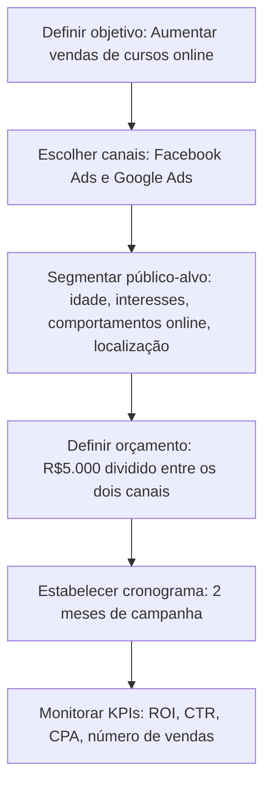

# Traffic Strategy Agent

O **TrafficStrategyAgent** é uma ferramenta inteligente para geração de **estratégias completas de tráfego pago**, incluindo canais, segmentação, orçamento, cronograma, KPIs e um diagrama visual em formato **Mermaid**. Ele utiliza a API da OpenAI para gerar conteúdo com base no objetivo informado.

Este agente pode ser acessado via **HTTP** ou **WebSocket**, e é ideal para aplicações que precisam automatizar a criação de planos de mídia personalizados.

---

## Objetivo do Projeto

Este projeto foi criado com os seguintes propósitos:

- Aprender a criar e personalizar ferramentas no ecossistema cloudflare.
- Explorar o uso de WebSockets com o Agents SDK.
- Integrar a API da OpenAI para geração de conteúdo dinâmico.
- Gerar estratégias visuais usando a linguagem de diagramas **Mermaid**.

---

## Funcionalidades

- Recebe um objetivo de marketing (texto simples).
- Retorna uma **estratégia de tráfego pago completa**, incluindo:
  - Canais de mídia (ex: Facebook Ads, Google Ads)
  - Segmentação de público
  - Orçamento estimado
  - Cronograma
  - KPIs (Indicadores de Performance)
  - Diagrama Mermaid representando o funil e canais

---

## Como funciona

### 1. HTTP (via Postman)

**Endpoint:** `POST /`  
**Content-Type:** `text/plain`  
**Body (raw):**

```text
Aumentar vendas de cursos online para iniciantes em marketing digital
```

Resposta esperada:

```text
1. Estratégia detalhada em texto:

- Canais: Utilizaremos Facebook Ads e Google Ads para atingir nosso público-alvo de forma eficaz.

- Segmentação de público: Segmentaremos nosso público-alvo por idade (18-35 anos), interesses em marketing digital, comportamentos online relacionados a cursos online e localização (países de língua portuguesa).

- Orçamento estimado: Investiremos um total de R$5.000, sendo dividido igualmente entre Facebook Ads e Google Ads.

- Cronograma: A campanha terá a duração de 2 meses, sendo o mês 1 focado em Facebook Ads e o mês 2 em Google Ads.

- KPIs: Os principais indicadores de desempenho serão o ROI (Return on Investment), CTR (Click-Through Rate), CPA (Custo por Aquisição) e número de vendas de cursos online.

2. Diagrama Mermaid:



---

## Configuração

O projeto exige uma variável de ambiente com a chave da OpenAI:

```text
OPENAI_API_KEY=your_openai_key_here
```

## Tecnologias Utilizadas

- Cloudflare Workers
- Hono
- Agents SDK
- OpenAI API
- WebSocket
- Mermaid.js
